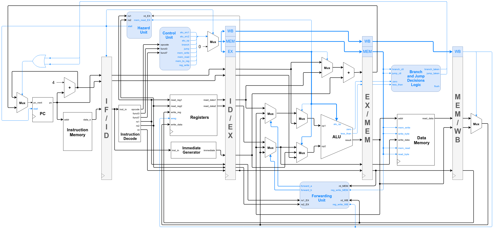

# RISC-V

## Sobre

Projeto e Implementação de didática de um softcore RISC-V

Este projeto é baseado na estrutura apresentada no livro *Computer Organization and Design: The Hardware Software Interface [RISC-V Edition]* de Patterson e Hennessy e tem como projeto base o [HF-RISC SoC](https://github.com/sjohann81/hf-risc).

## Modificações

Este projeto possui as seguintes alterações do projeto utilizado como base:

* Modificação da estrutura para um pipeline de 5 estágios

* Separação da Memória de Dados e da Memória de Instruções

* Adição da Unidade de Forwarding

* Adição da Unidade de Hazard

  

## Requisitos

A utilização do projeto em ambiente Linux requer:

* GHDL (Para simulação)
* GtkWave (Para visualizar as formas de ondas)

Instalação do ghdl e gtkwave:

```
sudo apt install gnat
git clone https://github.com/ghdl/ghdl.git
cd ghdl-master
./configure --prefix=/usr/local
make
sudo make install
sudo apt install gtkwave
```


## Como Simular

Primeiramente é necessário um arquivo `code.txt` na pasta raiz que contenha as instruções a serem carregadas na Memória de Instrução na inicialização da simulação. Este arquivo pode ser gerado a partir de um arquivo binário (`code.bin`) utilizando o comando `make code`.

A pasta `/codes` possui exemplos de programas em assembly (`.s`) e seu respectivo binário (`.bin`)


A simulação e a forma de onda do datapath completo pode ser obtida pelo comando:

```
make datapath
```


# Datapath




